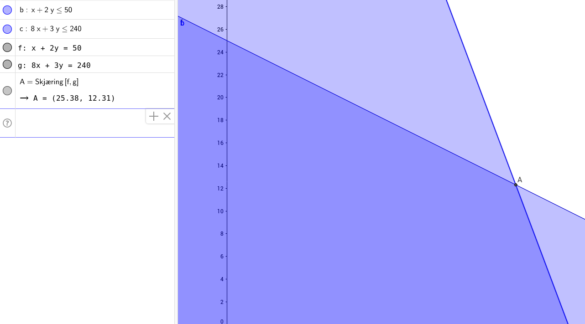

# Practicing the Simplex Algorithm

Maximize:
3x_1 + 5x_2

Subject to the constraints:

x_1 + 2x_2 <= 50

8x_1 + 3x_2 <= 240

x_1,x_2 >= 0

# 1. Solving graphically

### 3 * (25.38) + 5*(12.38) = 138.04

# 1. Solving with simplex algorithm
	Results of Linear Programming / Linear Optimization

	Objective function (Maximum): 137.692

	Iterations in phase 1: 0
	Iterations in phase 2: 2
	Solution
	      opt
	1 25.3846
	2 12.3077

	Basic Variables
	      opt
	1 25.3846
	2 12.3077

	Constraints
	  actual dir bvec free      dual dual.reg
	1     50  <=   50    0 2.3846154       20
	2    240  <=  240    0 0.0769231      165

	All Variables (including slack variables)
	        opt cvec min.c      max.c       marg marg.reg
	1   25.3846    3 2.500 13.3333333         NA       NA
	2   12.3077    5 1.125  6.0000000         NA       NA
	S 1  0.0000    0  -Inf  2.3846154 -2.3846154       20
	S 2  0.0000    0  -Inf  0.0769231 -0.0769231      165

# Linear Programming

1. Formula

Maximize:

4x_1 + 4x_2 + 7x_3

Subject to the constraints:

1x_1 + 2x_2 + 8x_3 <= 100

7x_1 + 1x_2 + 4x_3 <= 110

4x_1 + 7x_2 +1x_3 <= 100

x_1,x_2,x_3 >= 0

# output
	Results of Linear Programming / Linear Optimization

	Objective function (Maximum): 133.59

	Iterations in phase 1: 0
	Iterations in phase 2: 3
	Solution
	      opt
	1 9.23077
	2 7.66382
	3 9.43020

	Basic Variables
	      opt
	1 9.23077
	2 7.66382
	3 9.43020

	Constraints
	  actual dir bvec free     dual dual.reg
	1    100  <=  100    0 0.692308  73.5556
	2    110  <=  110    0 0.282051  60.0000
	3    100  <=  100    0 0.333333  51.7308

	All Variables (including slack variables)
	        opt cvec   min.c     max.c      marg marg.reg
	1   9.23077    4 2.16667 13.000000        NA       NA
	2   7.66382    4 1.75000  7.193548        NA       NA
	3   9.43020    7 1.60000 16.000000        NA       NA
	S 1 0.00000    0    -Inf  0.692308 -0.692308  73.5556
	S 2 0.00000    0    -Inf  0.282051 -0.282051  60.0000
	S 3 0.00000    0    -Inf  0.333333 -0.333333  51.7308

### 3.
there is no unused time on the machines

### 4.
extra hour on M3 -> 4x_1 + 7x_2 + 1x_3 <= 101

Objective function (Maximum): 133.923

133.923  - 133.59 = 0.333
